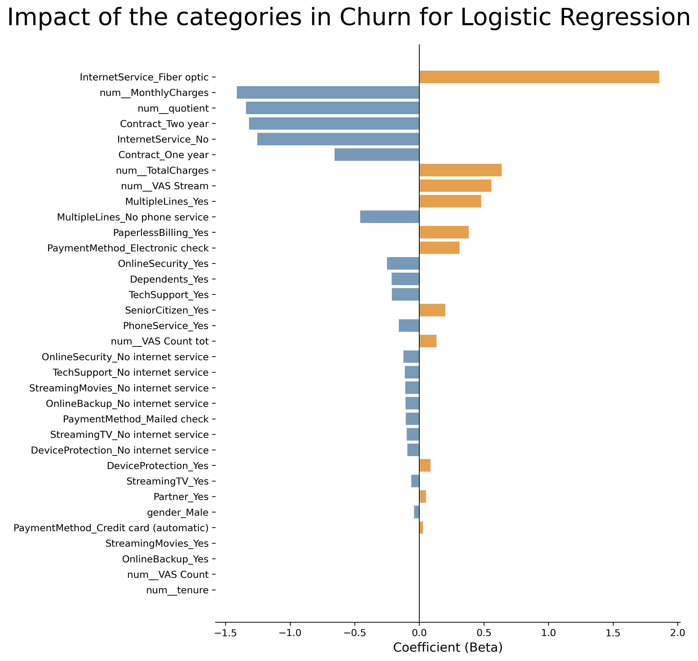
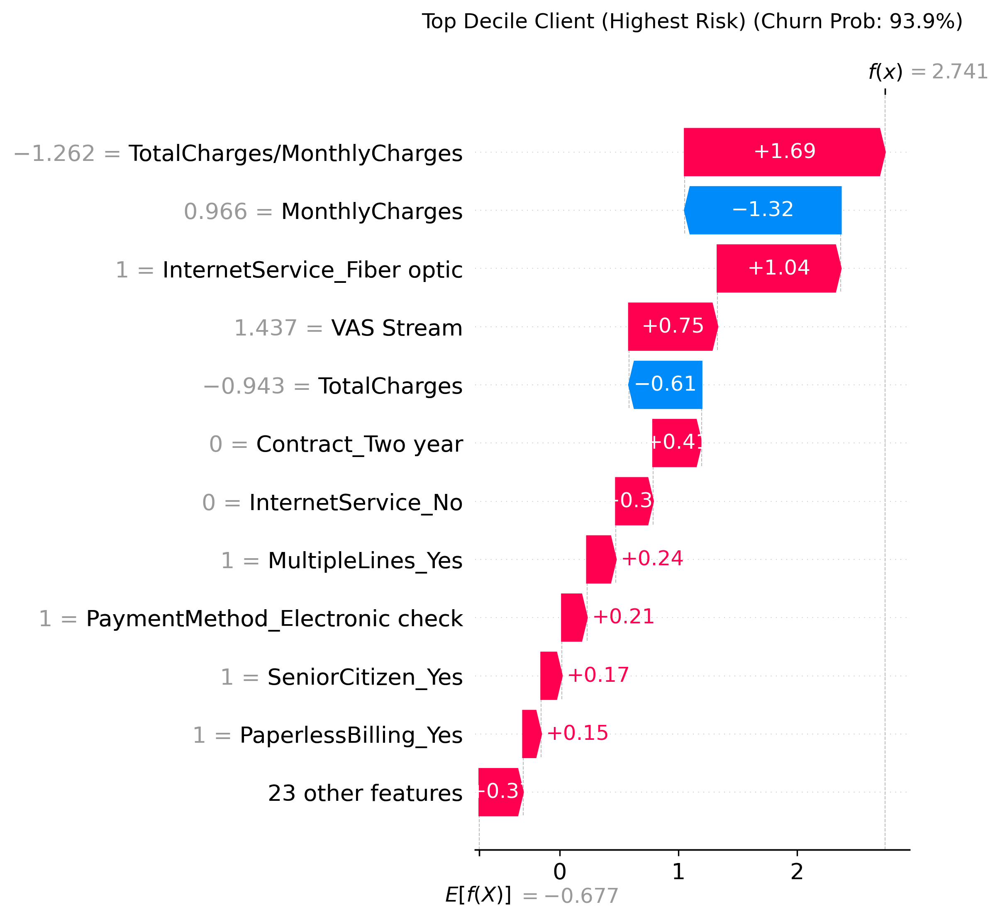

# Churn prediction and actionable insights for Telecommunications Industry 

*Maintained by [Gabriel Carrizo](https://www.linkedin.com/in/carrizogabriel/)*


## 🧠 1. Business Problem

In telecom companies, customer retention is more cost-effective than customer acquisition. Therefore, predicting churn and understanding its causes is critical for a company's growth.

In this project, we analyzed the key drivers of customer churn, identified the most predictive variables, implemented a machine learning algorithm to estimate the probability of churn for customers, identified target groups for retention campaigns using lift analysis, and evaluated the business implications across different scenarios.

----------

## 📊 2. Dataset

-   [Telco Customer Churn](https://www.kaggle.com/datasets/blastchar/telco-customer-churn) from [Kaggle](www.kaggle.com).
    
-   Contains 7043 rows (customers) and 21 columns (features). Each row corresponds to a client and each column to a feature.
    
-   Target variable: Churn
    
-   Class imbalance: 73.42% No, 26.58% Yes
    

---

## 🛠 3. Methodology

- Data overview and cleaning  
- EDA    
- Feature engineering    
- Model comparison
- Preprocessing with pipelines
- Hyperparameter Tuning with Random Search
- Cross-validation
- Lift analysis
- Model Interpretability
- Business analysis
- Customer Lifetime Value (CLV) estimation
- Scenario-based ROI simulations for alternative campaign strategies
    


----------
## 📁 4. Project Structure

```
Telcochurn/
│
├── 📂 data/
│   ├── 📂 raw/
│   │   └── WA_Fn-UseC_-Telco-Customer-Churn.csv  
│   └── 📂 outputs/
│       ├── target_list_churn.csv
│       ├── target_list_roi_optimized.csv
│       ├── target_list_top10_risk.csv
│       └──target_list_top30_risk.csv
├── 📂 docs/
│   └── 📂 img/
│       ├── logistic_regression_coefficients.png
│       └── shap_waterfall_example.png
├── 📂 notebooks/                 
│   └── churn.ipynb        
│
├── requirements.txt
├── environment.yml
└── README.md
```
----------
## ⚙️ 5. Stack
**Environment:** Jupyter Notebook · Python 3

-   **Data manipulation:** pandas, NumPy, SciPy
-   **Visualization:** Matplotlib, Seaborn
-   **Modeling:** scikit-learn, XGBoost
    -   Algorithms: Logistic Regression, SVM, Random Forest
    -   Pipelines: Pipeline, ColumnTransformer, StandardScaler, OneHotEncoder
    -   Tuning & validation: StratifiedKFold, RandomizedSearchCV
    -   Metrics: AUC-ROC, F1, Recall, Precision

----------
## 📈 6. Results

Through a cross validation the metrics obtained were
| Model               | Accuracy | Precission | Recall   | F1       | AUC      |   |
|---------------------|----------|------------|----------|----------|----------|---|
| Logistic Reggresion |  0.802844  | 0.655436   | 0.545819 | 0.595425 | **0.846033** |   |
| SVC                 | 0.802133 | 0.680362   | 0.484950 | 0.565853 | 0.802866 |   |
| RandomForest        | 0.792889 | 0.643282   | 0.495652 | 0.559612 | 0.828567 |   |
| XGBoost             | 0.788089 | 0.621190   | 0.517726 | 0.564458 | 0.830772 |   |

In most of measures the Logistic Regression was the best model. Due to the auc score, this was the chosen model. The relevance of this metric is that allow to decision makers to choose the threshold for the actions, keeping a good quality of churn predictions.

After parameter tunning:
-   ROC-AUC: 0.85  
-   Recall: 0.82 (it means that only 18% of the churn clients was not detected by the model)
-   Lift (10%):  2.8x
-   Lift (30%):  2.2x   

### 🔍 Model Explainability & Feature Drivers

Model explainability was approached at both global and local levels to ensure transparency and strategic utility.

* **Global Level (Logistic Regression Coefficients):** Evaluates overall population trends. High-risk predictors include Fiber Optic service, higher Total Charges, and streaming VAS subscriptions. Conversely, long-term contracts (One/Two Year) and low-complexity setups ("Telephone-only") serve as primary retention anchors.


*Figure: Global feature importance based on Logistic Regression coefficients ($\beta$).*

* **Local Level (SHAP Waterfall Plots):** Provides individual-level diagnostics by breaking down how specific feature values push or pull a given customer's churn risk away from the baseline average.


*Figure: SHAP Waterfall Plot for a High-Risk customer (93.9% Churn Prob), highlighting feature contributions for individual diagnosis.*

----------

## 💰 7. Business Impact

Under the assumptions of a 50% gross margin, targeting groups of customers rather than individuals, and assuming homogeneous response to the campaign, three scenarios were considered across two campaigns with a cost of 20 **USD** per customer. Acting on the optimal target, we project a net profit of 32,977 USD, with an ROI of 0.62, effectively preventing the churn of 145 customers in a neutral scenario

----------

## 🔎 8. Key Insights

1.  **Churn risk is highly concentrated.**  
    The top decile of customers is 2.8x more likely to churn compared to random selection, enabling efficient targeting.
    
2.  **Revenue exposure is significant.**  
    Estimated Revenue at Risk is approximately 1.96M USD if no intervention is implemented.
    
3.  **Targeted retention is economically viable.**
    
    -   A campaign targeting only the top 10% of customers requires a 10.6% success rate to break even.
    -   Expanding the campaign to the top 30% (deciles 8–10) reduces the breakeven threshold to 6.66% and substantially increases upside potential.
4.  **Risk-return profile favors broader targeting.**  
    Under neutral and optimistic scenarios, the 30% targeting strategy generates materially higher ROI while maintaining manageable downside risk.
5. **Explainability enables tailored interventions.** 
Global coefficients outline general population trends, while SHAP waterfall plots diagnose individual risk drivers (e.g., billing vs. service friction), ensuring retention offers match customer-specific root causes. 

----------
## 🧪 9. MLOps & Experiment Tracking with MLflow

To systematically track, compare, and reproduce model iterations, **MLflow** was integrated into the training pipeline.

### 🎯 Implementation Details
The MLflow tracking setup executes the following steps for each evaluated model within the experiment:

- **Hyperparameter Logging:** Automatically captures hyperparameter configurations for each classifier (`mlflow.log_params`).
- **Train vs. Test Metric Tracking:** Logs Accuracy, Precision, Recall, F1-Score, and ROC-AUC for both training and test sets to evaluate potential overfitting (`mlflow.log_metric`).
- **Model Artifact Logging:** Saves the fitted scikit-learn pipeline/model artifacts for future deployment (`mlflow.sklearn.log_model`).
- **Custom Visual Artifacts:** Generates and logs custom evaluation plots, such as the Precision-Recall threshold trade-off curve (`mlflow.log_artifact`).

---

### 🛠️ How to View Logged Experiments
**Launch the MLflow User Interface:**
   ```bash
   mlflow ui
   ```
Access the Dashboard:
Open http://127.0.0.1:5000 in your web browser to compare runs, inspect metric logs across models, and view attached plot artifacts.

Load a Saved Model Run:
```python
import mlflow.sklearn

# Load a logged model artifact using its Run ID
model_uri = "runs:/<RUN_ID>/model"
loaded_model = mlflow.sklearn.load_model(model_uri)

# Predict on new data
predictions = loaded_model.predict(X_test)
```

---
## 🚀 10. How to Run

**Option A: Using Conda**

```bash
# Clone the repository 
git clone https://github.com/gabarosky/Telcochurn.git
cd Telcochurn

# Create and activate the environment
conda env create -f environment.yml
conda activate ml

# Launch Jupyter
jupyter notebook notebooks/churn.ipynb
```

**Option B: Using Pip**
```bash 
# Clone the repository
git clone https://github.com/gabarosky/Telcochurn.git
cd Telcochurn

# Install dependencies
pip install -r requirements.txt

# Launch Jupyter
jupyter notebook notebooks/churn.ipynb
```

**Recommended:** Python 3.11+` 

---
### 🚀 11. Scalability & Potential Extensions

* **Interactive Retention Interface:** The model pipeline and SHAP explainer can be wrapped into a Streamlit application, allowing non-technical marketing teams to visually inspect customer risk profiles in real time.
* **CRM API Integration:** The system supports deployment via a lightweight REST API (e.g., FastAPI) to deliver real-time churn scores and primary risk drivers directly into external CRM or support platforms.
----------

Made by [Gabriel Carrizo](https://www.linkedin.com/in/carrizogabriel/) · MIT License
